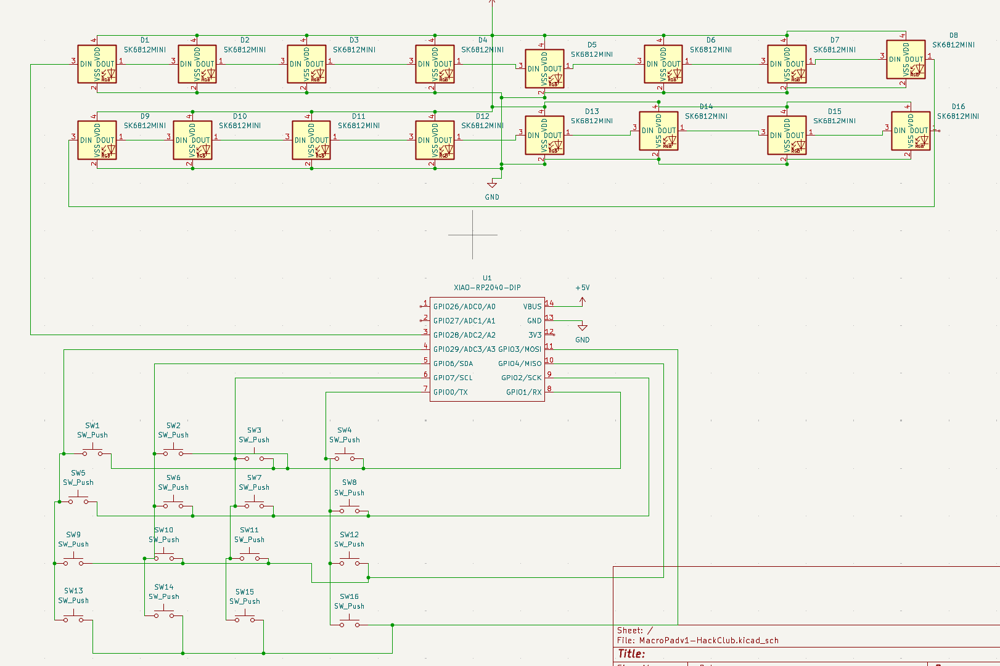
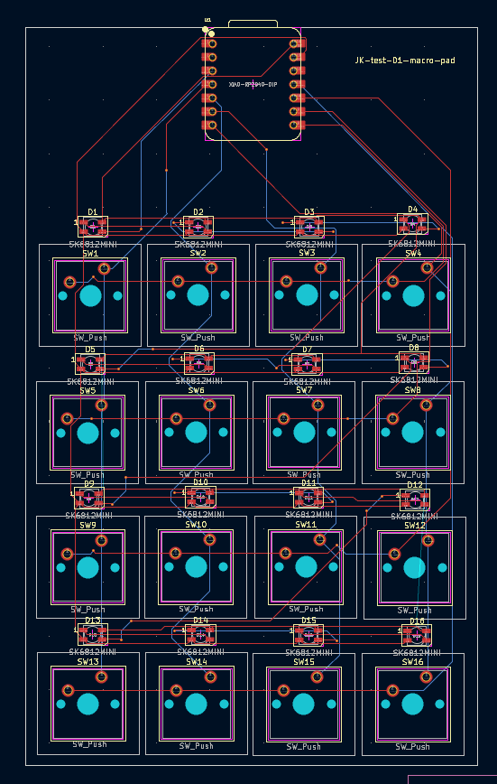
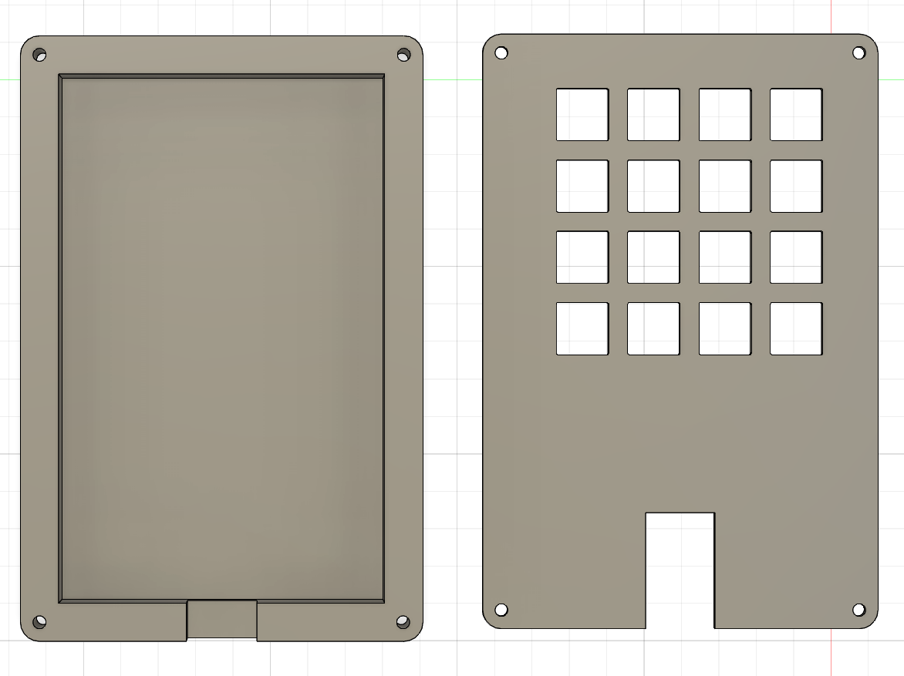

# Macropad-Hackclub
This is an Macro pad with 16 Buttons with background lighting. Its meant for simplicity and an everyday use. This is the reason why it will have shortcuts for Windows 11. You could adjust the Container of the PCB so that the lights are looking out, but scince I never saw this kind of LED I don't know how big the hole has to be.

In this picture you can see the Box in gray and the PCB in Green.

Here you can see the shematics of th PCB. It could happen that the Analog pins won't allow Digitalinput, then you schould switsh to an other microcontroller (arduino/ESP) with more pins.

Here you can see the PCB and all the components which you have to mount on it. The dimensions are 137x84.5mm this is more than the limit of 100mm in one dimension, but it would become very messy when you would pack it closer together.

You can see here all the parts you need for the case just screew 4 screews in it and its ready to go.

BOM: (list of materials)
- 1 PCB
- 1 Case ( bittom + top part)
- M3x16mm screws
- M3x5mx4mm heatset inserts
- 16 Cherry MX 1 Keyboardbuttons
- 16 Keycaps
- 16 SK6812 MINI-E LEDs
- 1 Seeed XIAO RP2040
